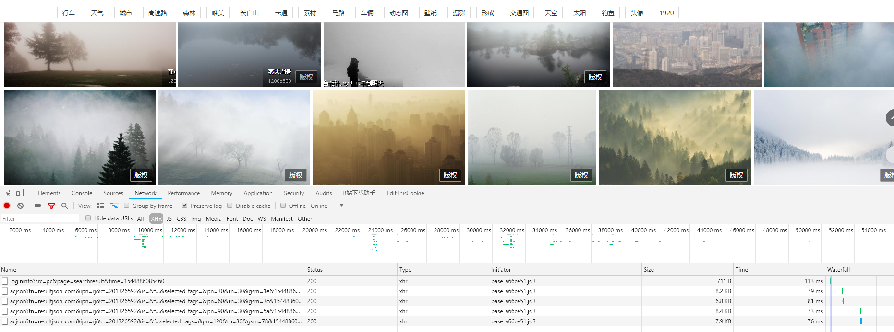
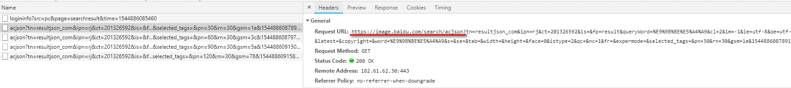
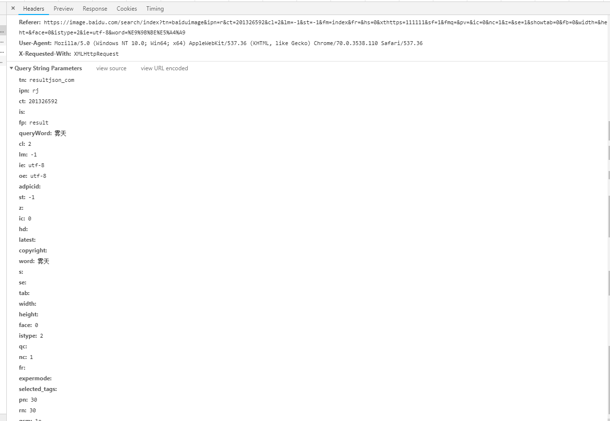
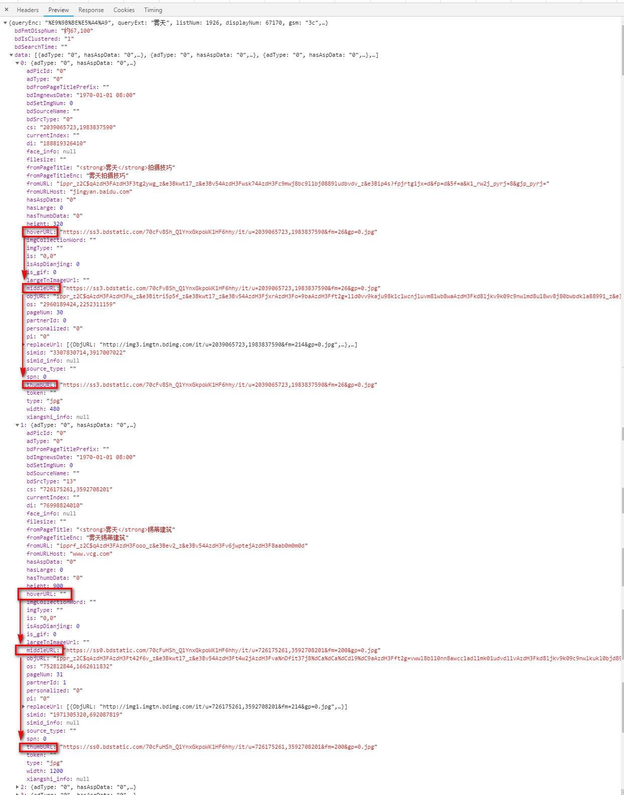

# 百度图片爬虫
> 由于深度学习需要搜集大量图片，所以写了个爬虫，仅供参考。

## 1、分析请求地址

接下来开始分析

百度图片是通过鼠标滚动才会发送请求翻页，我们通过几次翻页发现了请求地址

后面的参数在下面可以看到

经过几次翻页发现只有pn发生变化，word为关键词，其他的不变

## 2、分析图片路径

> 请求的response是一个json数据，通过下图可以发现`hoverURL`、`middleURL`、`thumbURL`这三个存在图片地址，有时`hoverURL`为空，所以在代码中进行判断即可

 

## 2、代码

代码详见文件
